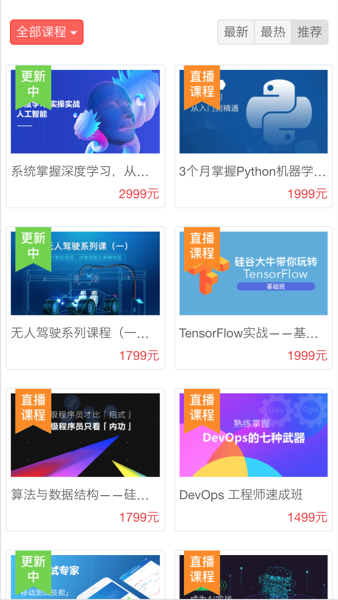
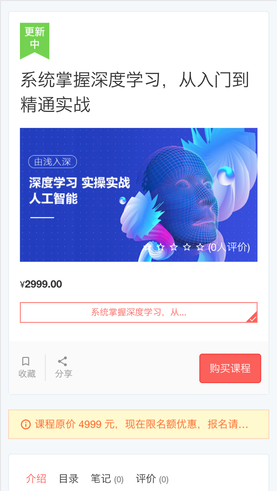
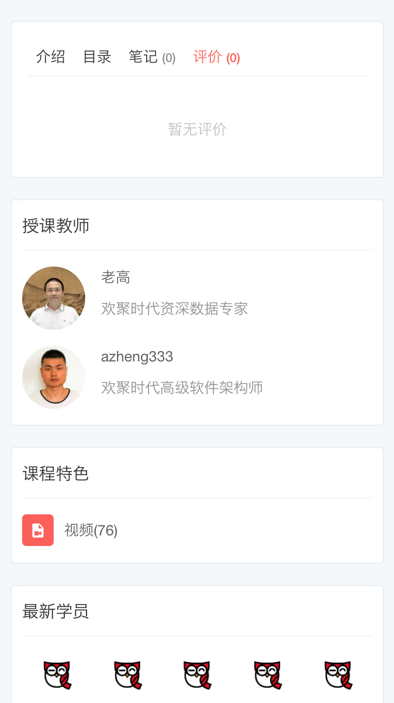

# coursehaha

## 目录

- [使用json-server模拟接口]()
- [完成h5页面，列表和详情]()
- [完成用户授权oauth认证]()
- [完成管理后台页面]()
- [完成支付功能]()
- [完成部署]()

## 效果

课程信息推导

- 课程名称
- 价格
- 头图
- 状态标签：更新中、直播课程

课程信息推导

- 评价总人数
- 评价平均分数
- 教学计划：系统掌握深度学习，从...
- 学习有效期：365 天（随到随学）
- 课程提示： 课程原价 4999 元，现在限名额优惠，报名请尽快扫码咨询课程小助手
- 课程介绍
  - 目录
  - 笔记
  - 评价
- 课程目标
- 适合人群
- 授课教师
- 课程特色
- 最新学员（最多20）
- 学员动态：5条，xxx加入学习

## 模型

- 课程信息表
  - 分类（/首页/人工智能/系统掌握深度学习，从入门到精通实战）
  - 课程名称
  - 价格
  - 头图
  - 状态标签：更新中、直播课程、不可用
  - 教学计划：系统掌握深度学习，从...
  - 学习有效期：365 天（随到随学）
  - 课程提示： 课程原价 4999 元，现在限名额优惠，报名请尽快扫码咨询课程小助手
  - 课程目标
  - 适合人群
  - 学员动态：（5条，xxx加入学习）
  - 评价总人数（当评价表增加新数据，异步更新）
  - 评价平均分数（当评价表增加新数据，异步更新）
  - 最新学员（多个，最多20）
  - 授课教师（多个）
  - 目录（多个）
  - 笔记（多个）
  - 评价（多个）
  - 用户（多个）
- 目录
  - 章
    - 节（url）
- 笔记
  - 用户：chenjielin · 
  - 时间：26天前 
  - 标签 作业
- 评价
  - 用户
  - 默认教学计划 
  - 完成进度:10/19   
  - 时间：2017-10-17
  - 评价分数
- 用户（角色：学员，教师）
  - 名字
  - 头像
  - 一句话介绍
  - 个人签名
  - 角色（是否为讲师，默认不是）
  