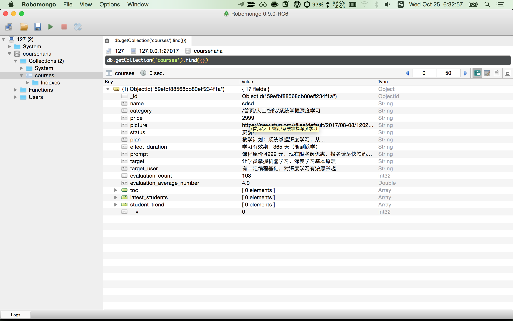
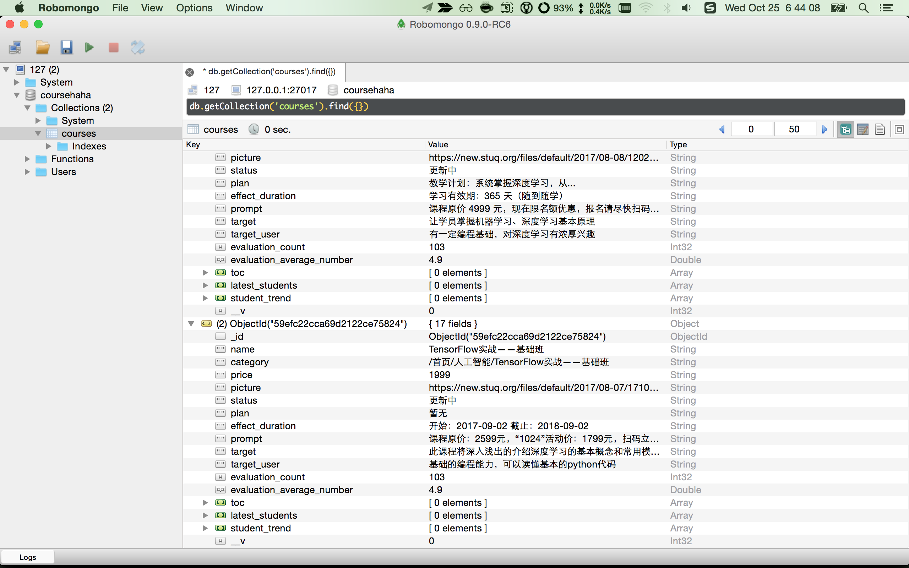

# 数据模型和数据库入门

准备基础库

```
$ npm i -S bluebird mongoose mongoosedao mongoose-auto-increment
```


- http://chaijs.com/
- http://mochajs.org/

安装测试依赖

```
$ npm i -D mocha chai
```


配置npm scripts

```
 "scripts": {
    "test": "./node_modules/.bin/mocha -u bdd"
  },
```

创建第一个测试test/test.js

```
var assert = require('assert');
describe('Array', function() {
  describe('#indexOf()', function() {
    it('should return -1 when the value is not present', function() {
      assert.equal(-1, [1,2,3].indexOf(4));
    });
  });
});
```

可以按照个人习惯使用chai替换默认断言(主要是断言写法上的差异)

```
var chai = require('chai');  
var assert = chai.assert;    // Using Assert style
var expect = chai.expect;    // Using Expect style
var should = chai.should();  // Using Should style
```

执行npm test测试

```
$ npm test
```

下载安装mongodb，然后安装mh用于启动mongodb

```
$ npm i -g mh 
$ mhg
```

检查db.js中使用config/mongodb.js配置，一定要和你本机的mongodb匹配

```
module.exports = {
    "host": "127.0.0.1",
    "port": "27017",
    "db": "coursehaha",
    "is_debug": true
};
```

编写db_test.js

```
require('./db')
var Course = require('./app/model/course')

console.log(Course)

Course.create({
    name: "sdsd", //课程名称
    category: "/首页/人工智能/系统掌握深度学习",
    price: 2999, //价格
    picture: "https://new.stuq.org//files/default/2017/08-08/120213522984724939.jpg" ,//头图
    status: "更新中", //状态标签：更新中、直播课程、不可用
    plan: "教学计划：系统掌握深度学习，从...", //教学计划：系统掌握深度学习，从...
    effect_duration: "学习有效期：365 天（随到随学）", //学习有效期：365 天（随到随学）
    prompt: "课程原价 4999 元，现在限名额优惠，报名请尽快扫码咨询课程小助手", //课程提示： 课程原价 4999 元...
    target: "让学员掌握机器学习、深度学习基本原理", //课程目标
    target_user: "有一定编程基础，对深度学习有浓厚兴趣", //适合人群
    student_trend: [], //学员动态：（5条，xxx加入学习）
    evaluation_count: 103, //当评价表增加新数据，异步更新
    evaluation_average_number: 4.9, //当评价表增加新数据，异步更新
    latest_students: [], //最新学员（多个，最多20）
    toc: [], //目录
})

```

打开robo查看一下，如果创建成功，就能查出来数据



这种办法虽然笨，但很直接，对于新手来说是非常简单的。

创建多条数据，比如保证课程名不允许重复

app/model/course.js

```
name: { type: String, unique: true }, //课程名称
```

此时

```
require('./db')

var Course = require('./app/model/course')
// console.log(Course)

Course.create({
    name: "系统掌握深度学习，从入门到精通实战", //课程名称
    category: "/首页/人工智能/系统掌握深度学习",
    price: 2999, //价格
    picture: "https://new.stuq.org/files/default/2017/08-08/120213522984724939.jpg" ,//头图
    status: "更新中", //状态标签：更新中、直播课程、不可用
    plan: "教学计划：系统掌握深度学习，从...", //教学计划：系统掌握深度学习，从...
    effect_duration: "学习有效期：365 天（随到随学）", //学习有效期：365 天（随到随学）
    prompt: "课程原价 4999 元，现在限名额优惠，报名请尽快扫码咨询课程小助手", //课程提示： 课程原价 4999 元...
    target: "让学员掌握机器学习、深度学习基本原理", //课程目标
    target_user: "有一定编程基础，对深度学习有浓厚兴趣", //适合人群
    student_trend: [], //学员动态：（5条，xxx加入学习）
    evaluation_count: 103, //当评价表增加新数据，异步更新
    evaluation_average_number: 4.9, //当评价表增加新数据，异步更新
    latest_students: [], //最新学员（多个，最多20）
    toc: [], //目录
})

Course.create({
    name: "TensorFlow实战——基础班", //课程名称
    category: "/首页/人工智能/TensorFlow实战——基础班",
    price: 1999, //价格
    picture: "https://new.stuq.org/files/default/2017/08-07/171053d85903252716.jpg" ,//头图
    status: "更新中", //状态标签：更新中、直播课程、不可用
    plan: "暂无", //教学计划：系统掌握深度学习，从...
    effect_duration: "开始：2017-09-02   截止：2018-09-02", //学习有效期：365 天（随到随学）
    prompt: "课程原价：2599元，“1024”活动价：1799元，扫码立即购买。", //课程提示： 课程原价 4999 元...
    target: " 此课程将深入浅出的介绍深度学习的基本概念和常用模型，并给出使用TensorFlow实现这些模型和算法的最佳实践。", //课程目标
    target_user: "基础的编程能力，可以读懂基本的python代码", //适合人群
    student_trend: [], //学员动态：（5条，xxx加入学习）
    evaluation_count: 103, //当评价表增加新数据，异步更新
    evaluation_average_number: 4.9, //当评价表增加新数据，异步更新
    latest_students: [], //最新学员（多个，最多20）
    toc: [], //目录
})

```

在查询



那么在代码里如何查询呢？db_find_test.js

```
var db = require('./db')
var Course = require('./app/model/course')
// console.log(Course)

db.once('open', function () {
    var all = Course.all(function (err, users) {
        console.log(users)
    })
})
```

注意：这里的all方法是mongoosedao提供的，如果是直接mongoose模型，使用find是一样的。

执行

```
$ node db_find_test.js
提醒:debug状态连接数据库:
mongodb://127.0.0.1:27017/coursehaha
[mongoose log] Successfully connected to:  NaN
mongoose open success
[ { _id: 59efc22cca69d2122ce75823,
    name: '系统掌握深度学习，从入门到精通实战',
    category: '/首页/人工智能/系统掌握深度学习',
    price: '2999',
    picture: 'https://new.stuq.org/files/default/2017/08-08/120213522984724939.jpg',
    status: '更新中',
    plan: '教学计划：系统掌握深度学习，从...',
    effect_duration: '学习有效期：365 天（随到随学）',
    prompt: '课程原价 4999 元，现在限名额优惠，报名请尽快扫码咨询课程小助手',
    target: '让学员掌握机器学习、深度学习基本原理',
    target_user: '有一定编程基础，对深度学习有浓厚兴趣',
    evaluation_count: 103,
    evaluation_average_number: 4.9,
    __v: 0,
    toc: [],
    latest_students: [],
    student_trend: [] },
  { _id: 59efc22cca69d2122ce75824,
    name: 'TensorFlow实战——基础班',
    category: '/首页/人工智能/TensorFlow实战——基础班',
    price: '1999',
    picture: 'https://new.stuq.org/files/default/2017/08-07/171053d85903252716.jpg',
    status: '更新中',
    plan: '暂无',
    effect_duration: '开始：2017-09-02   截止：2018-09-02',
    prompt: '课程原价：2599元，“1024”活动价：1799元，扫码立即购买。',
    target: ' 此课程将深入浅出的介绍深度学习的基本概念和常用模型，并给出使用TensorFlow实现这些模型和算法的最佳实践。',
    target_user: '基础的编程能力，可以读懂基本的python代码',
    evaluation_count: 103,
    evaluation_average_number: 4.9,
    __v: 0,
    toc: [],
    latest_students: [],
    student_trend: [] } ]
```

是不是很简单？

