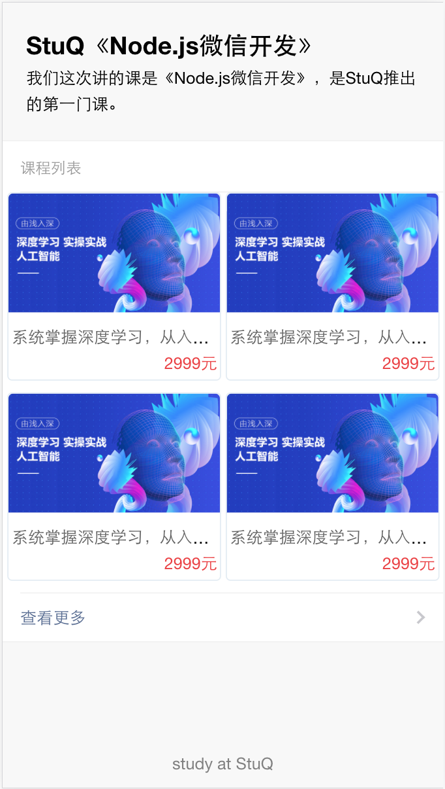
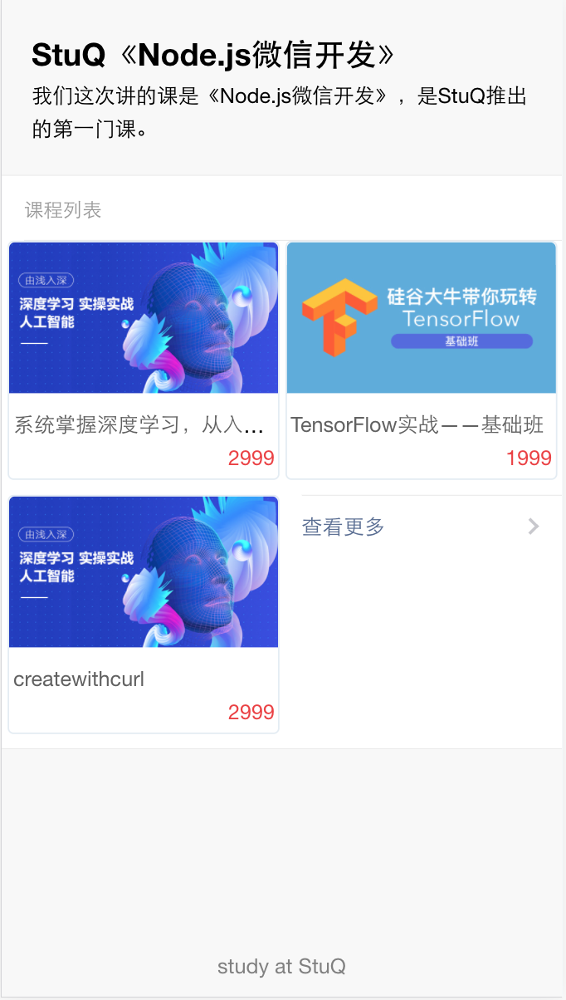
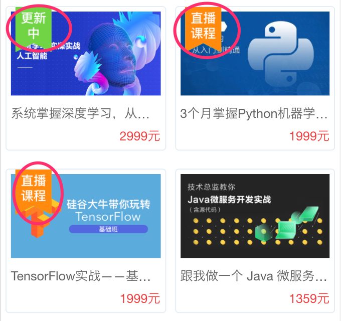

# 完成h5页面，列表和详情

对于实现h5页面有3种方式

- 服务器直出（传统的render）
- 纯的前后端分离（ajax）
- Api Proxy（node先获取api，然后render）

这个是要视业务场景和而定的架构来决定的。

本节从简，以最简单的render模式


## 去掉jade使用art-template

默认生成的是jade，我很喜欢jade的极简风格，唯一麻烦的就是要有转换思维，对初学者来说略麻烦。这里为了照顾大家，使用art-template，它类似jsp、asp、php等直接使用html标签的语法，可读性上更好，对新手更友好。

[art-template](https://github.com/aui/art-template) 是一个简约、超快的模板引擎。它采用作用域预声明的技术来优化模板渲染速度，从而获得接近 JavaScript 极限的运行性能，并且同时支持 NodeJS 和浏览器。


app.js

```
// view engine setup
app.engine('art', require('express-art-template'));

app.set('view options', {
    debug: process.env.NODE_ENV !== 'production'
});
// app.set('views', path.join(__dirname, 'views'));
// app.set('view engine', 'jade');
app.set('views', path.join(__dirname, 'views'));
app.set('view engine', 'art');
```

将默认的express-generator生成的jade转成art

layout.art

```
<!--
doctype html
html
  head
    title= title
    link(rel='stylesheet', href='/stylesheets/style.css')
  body
    block content
-->
<!doctype html>
<html>
<head>
    <meta charset="utf-8">
    <link rel="stylesheet" href="/stylesheets/style.css">
</head>
<body>
    {{block 'content'}}{{/block}}
</body>
</html>
```

index.art

```
<!--
extends layout

block content
  h1= title
  p Welcome to #{title}
-->

<% extend('./layout.art') %>
<% block('content', function(){ %>
  <h1>{{h1}}</h1>
  <p> Welcome to {{title}} </p>
<% }) %>
```

error.art

```
<!--
extends layout

block content
  h1= message
  h2= error.status
  pre #{error.stack}
-->

<% extend('./layout.art') %>
<% block('content', function(){ %>
  <h1>{{message}}</h1>
  <h2>{{error.status}}</h2>
  <pre> {{error.stack}} </pre>
<% }) %>
```

性能，其实在小量的时候确实比jade好，但量大的时候比jade要弱一点。

## 引入weui

新版本变化

- https://github.com/Tencent/weui
- https://github.com/Tencent/weui.js(如果不下载，在weui的例子里有min.js引用，为了学习建议下载)

weui.js省去了之前的很多麻烦

- 取出dist下面的文件

## 列表


第一步，下整理静态页面
http://127.0.0.1:3000/static/list

渲染时用的是views/static_list.art

```
<% extend('./layout_weui.art') %>
<% block('content', function(){ %>

  {{include './tpl_static_home.art'}}

<% }) %>
```

```
router.get('/static/list', function (req, res, next) {
  Course.all(function (err, courses) {
    console.log(courses)
    res.render('static_list', { 
      title: 'Express',
      courses:courses
    });
  })
});
```

views/tpl_static_home.art

- .weui-pane
  - .course_list
    - .course_item
    - .course_item
    - .course_item
    - .course_item

纯静态html，实现了一个列表course_list，每项是course_item。代码比较简单。为了看着更舒服，最外层套了一下weui-pane的样式。


  

第二步，实现数据与模板结合，动起来

```
router.get('/', function (req, res, next) {
  Course.all(function (err, courses) {
    console.log(courses)
    res.render('index', { 
      title: 'Express',
      courses:courses
    });
  })
});
```

views/index.art

```
<% extend('./layout_weui.art') %>
<% block('content', function(){ %>

  {{include './page/tpl_home.art' $data}}

<% }) %>
```

注意

- include的是./page/tpl_home.art
- include后面有要传递的参数$data

在views/page/tpl_home.art里，主要处理列表course_list，将里面的course_item都删掉，直流一个放到views/page/course_item.art里，作为item的模板

```
<div class="page__bd ">
    <div class="weui-panel weui-panel_access">
        <div class="weui-panel__hd">课程列表</div>
        <div class="weui-panel__bd">
            <div class="page__bd course_list">
                {{each $data.courses}}
                    {{include './course_item.art' $value}}
                {{/each}}
            </div>
        </div>
        <div class="weui-panel__ft">
            <a href="javascript:void(0);" class="weui-cell weui-cell_access weui-cell_link">
                <div class="weui-cell__bd">查看更多</div>
                <span class="weui-cell__ft"></span>
            </a>
        </div>
    </div>
</div>
```

artTemplate里的for循环api是https://aui.github.io/art-template/docs/syntax.html#Loop。


```
{{each target}}
    {{$index}} {{$value}}
{{/each}}
```

等价于

```
<% for(var i = 0; i < target.length; i++){ %>
    <%= i %> <%= target[i] %>
<% } %>
```

区分出$index和$value就好。还是非常简单的。


views/page/course_item.art将里面的可变的内容，替换成模板就好啦。

```
<div class='course_item'>
    <div class="course-img">
        <a href="/course/49" target="_blank">
            <span class="tags">
                <span class="tag-serialing"></span>
            </span>
            
        </a>
    </div>
    <div class="course-info">
        <div class="title">
            <a class="link-dark" href="/course/{{_id}}" target="_blank">
                {{name}}
            </a>
        </div>
        <div class="metas clearfix">
            <span class="comment">
                <i class="es-icon es-icon-textsms"></i>
                0
            </span>

            <span class="course-price-widget">
                <span class="price">
                    {{price}}
                </span>
            </span>
        </div>
    </div>
</div>
```

效果如下，3个看起来好诡异，是不是




## 常见做法

- 首页显示top n
- 首页精选
- 点击【查看更多】，跳到具体列表

精选稍麻烦，我们先以top n为例，差别就在于查询课程的方式。创建db_find_n_test.js，通过mongoosedao里的top方法获取。如果要换成精选就是where精选=true，类似。

```
var db = require('./db')
var Course = require('./app/model/course')
// console.log(Course)

db.once('open', function () {
    var all = Course.top(2,function (err, users) {
        console.log(users)
    })
})
```

修改路由

```
/* GET home page. */
router.get('/', function (req, res, next) {
  var num = req.query.num ? req.query.num : 2

  Course.top(num, function (err, courses) {
    console.log(courses)
    res.render('index', { 
      title: 'Express',
      courses:courses
    });
  })
});

/* GET list page. */
router.get('/list', function (req, res, next) {
  Course.all(function (err, courses) {
    console.log(courses)
    res.render('index', { 
      title: 'Express',
      courses:courses
    });
  })
});
```

现在routes/index.js有3个路由

- / 首页，显示top n（将all改为top方法）
- /list 获取所有（和之前逻辑一样，使用all方法）
- /static/list 是之前的静态html列表

修改查看更多，跳转到/list

```
<div class="weui-panel__ft">
    <a href="/list" class="weui-cell weui-cell_access weui-cell_link">
        <div class="weui-cell__bd">查看更多</div>
        <span class="weui-cell__ft"></span>
    </a>
</div>
```

## 重构一下

- top n有查看详情
- 所有list里不应该有查看详情

其实在路由返回数据的时候是可以控制的。最简单的办法如下

在artTemplate里判断条件是这样的

```
{{if value}} ... {{/if}}
```

于是在tpl_home里

```
{{if value}} 
    <div class="weui-panel__ft">
        <a href="/list" class="weui-cell weui-cell_access weui-cell_link">
            <div class="weui-cell__bd">查看更多</div>
            <span class="weui-cell__ft"></span>
        </a>
    </div>
{{/if}}
```

那么这个value是啥呢？其实就看你路由里render的时候传的数据的内容

```
/* GET home page. */
router.get('/', function (req, res, next) {
  var num = req.query.num ? req.query.num : 2

  Course.top(num, function (err, courses) {
    console.log(courses)
    res.render('index_v2', { 
      title: 'Express',
      show_mode: true,
      courses:courses
    });
  })
});

/* GET list page. */
router.get('/list', function (req, res, next) {
  Course.all(function (err, courses) {
    console.log(courses)
    res.render('index_v2', { 
      title: 'Express',
      show_mode: false,
      courses:courses
    });
  })
});
```

- 这里index_v2和index.art的区别在于 {{include './list/tpl_home.art' $data}}。为了演示，我们将新代码放到list目录了
- 通过show_mode来控制，是否显示更多。

于是

```
{{if $data.show_mode}} 
    <div class="weui-panel__ft">
        <a href="/list" class="weui-cell weui-cell_access weui-cell_link">
            <div class="weui-cell__bd">查看更多</div>
            <span class="weui-cell__ft"></span>
        </a>
    </div>
{{/if}}
```

测试，完美。

topn虽然很好用，但万一返回的结果是奇数个呢？还是会bug

```
/* GET home page. */
router.get('/', function (req, res, next) {
  var num = req.query.num ? req.query.num : 2

  Course.top(num, function (err, courses) {
    if (courses.length > 1 && courses.length % 2 === 1){
      // 移除最后一个
      courses.pop()
    }
    console.log(courses)
    res.render('index_v2', { 
      title: 'Express',
      show_mode: true,
      courses:courses
    });
  })
});
```

如果没有课程呢？是不是要提示一下。

http://127.0.0.1:3000/?num=1

```
 <div class="weui-panel weui-panel_access">
    <div class="weui-panel__hd">课程列表</div>
    <div class="weui-panel__bd">
        <div class="page__bd course_list">
            {{each $data.courses}} 
                {{include './course_item.art' $value}} 
            {{/each}}
            {{if !$data.courses || $data.courses.length === 0}}
                <center> 一个课程都没有，怪我喽？。。。</center>
            {{/if}}
        </div>
    </div>
    {{if $data.show_mode}}
    <div class="weui-panel__ft">
        <a href="/list" class="weui-cell weui-cell_access weui-cell_link">
            <div class="weui-cell__bd">查看更多</div>
            <span class="weui-cell__ft"></span>
        </a>
    </div>
    {{/if}}
</div>
```

剩下的其实都是类似的小细节。

核心

> 时刻区分可变与不变

## 思考

和stuq官方的还差一个tag



如何实现呢？

注意tag是使用图片实现的，自己想想这种实现好不好

- https://new.stuq.org/static-dist/app/img/tag_serialing.png
- https://new.stuq.org/static-dist/app/img/tag_live.png

## 详情


### 准备接口

- 获取详情的视图 /courses/:id

在routes/index.js增加这个路由，其实和前面api几乎是一模一样的。

```
/* GET course detail page. */
router.get('/courses/:id', function (req, res, next) {
  var cid = req.params.id
  Course.getById(cid, function (err, course) {
    console.log(course)
    res.render('detail', { 
      course: course
    });
  })
});
```

### detail.art

页面实现，原理同列表页，只是简单的html/css和模板用法。

### 修改列表页跳转链接

目前所有的课程，都应该跳转 `/courses/:id`

根据列表页的实现，我们知道/list/course_item.art是具体的模板（独立的好处就是体现粗来了）

```
<div class='course_item'>
    <div class="course-img">
        <a href="/courses/{{_id + ""}}" target="_self">
            <span class="tags">
                <span class="tag-serialing"></span>
            </span>
            
        </a>
    </div>
    <div class="course-info">
        <div class="title">
            <a class="link-dark" href="/course/{{_id  + ""}}" target="_self">
                {{name}}
            </a>
        </div>
        <div class="metas clearfix">
            <span class="comment">
                <i class="es-icon es-icon-textsms"></i>
                0
            </span>

            <span class="course-price-widget">
                <span class="price">
                    {{price}}
                </span>
            </span>
        </div>
    </div>
</div>
```

## 总结

本节主要是为了说明模板引擎使用和如何编写页面，知道前置条件是什么，如何思考。

本节实现课程列表和课程详情的绝大部分功能，其他的大家试试，自己完善一下，一定要动手写，多对比，才能理解其中的好处。

那么，如果想加一个管理后台该怎么办呢？后台使用的接口和这个接口如何做api鉴权？
