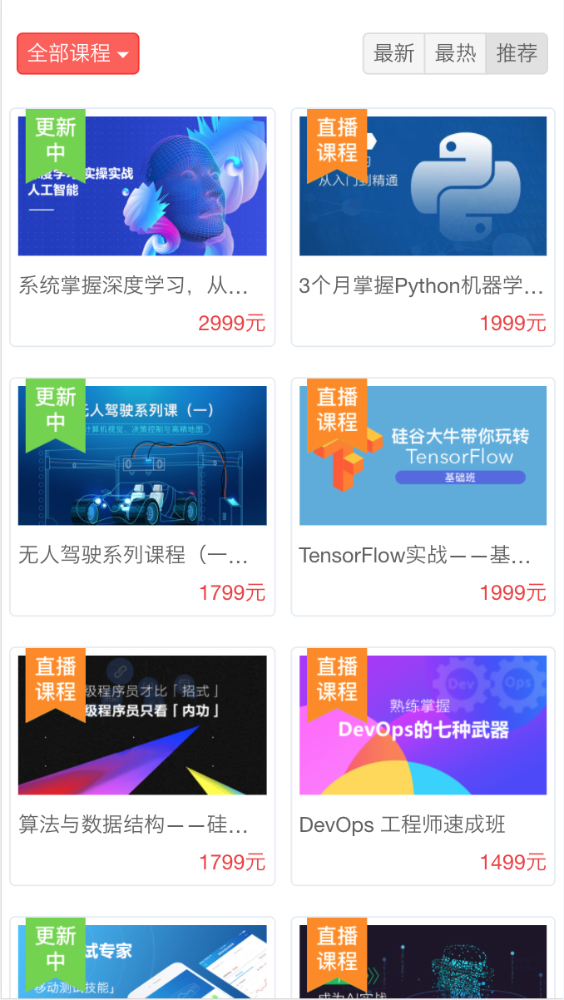
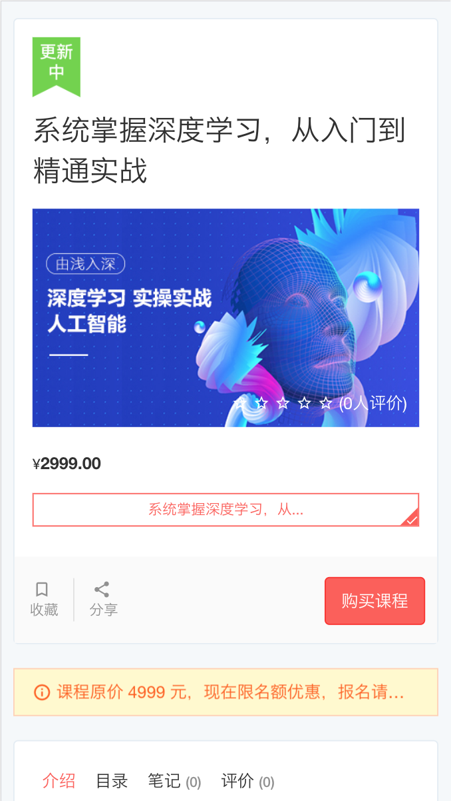
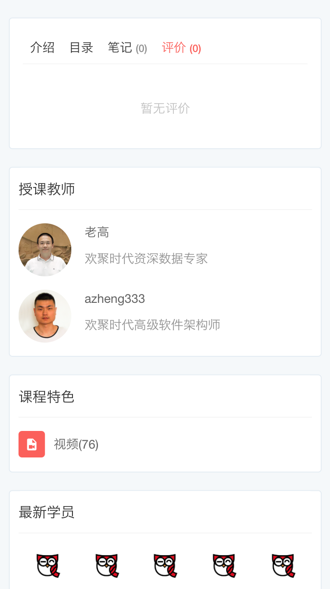

# 完成h5页面，列表和详情

对于实现h5页面有3种方式

- 服务器直出（传统的render）
- 纯的前后端分离（ajax）
- Api Proxy（node先获取api，然后render）

这个是要视业务场景和而定的架构来决定的。

本节从简，以最简单的render模式


## 去掉jade使用art-template

默认生成的是jade，我很喜欢jade的极简风格，唯一麻烦的就是要有转换思维，对初学者来说略麻烦。这里为了照顾大家，使用art-template，它类似jsp、asp、php等直接使用html标签的语法，可读性上更好，对新手更友好。

[art-template](https://github.com/aui/art-template) 是一个简约、超快的模板引擎。它采用作用域预声明的技术来优化模板渲染速度，从而获得接近 JavaScript 极限的运行性能，并且同时支持 NodeJS 和浏览器。


app.js

```
// view engine setup
app.engine('art', require('express-art-template'));

app.set('view options', {
    debug: process.env.NODE_ENV !== 'production'
});
// app.set('views', path.join(__dirname, 'views'));
// app.set('view engine', 'jade');
app.set('views', path.join(__dirname, 'views'));
app.set('view engine', 'art');
```

将默认的express-generator生成的jade转成art

layout.art

```
<!--
doctype html
html
  head
    title= title
    link(rel='stylesheet', href='/stylesheets/style.css')
  body
    block content
-->
<!doctype html>
<html>
<head>
    <meta charset="utf-8">
    <link rel="stylesheet" href="/stylesheets/style.css">
</head>
<body>
    {{block 'content'}}{{/block}}
</body>
</html>
```

index.art

```
<!--
extends layout

block content
  h1= title
  p Welcome to #{title}
-->

<% extend('./layout.art') %>
<% block('content', function(){ %>
  <h1>{{h1}}</h1>
  <p> Welcome to {{title}} </p>
<% }) %>
```

error.art

```
<!--
extends layout

block content
  h1= message
  h2= error.status
  pre #{error.stack}
-->

<% extend('./layout.art') %>
<% block('content', function(){ %>
  <h1>{{message}}</h1>
  <h2>{{error.status}}</h2>
  <pre> {{error.stack}} </pre>
<% }) %>
```

性能，其实在小量的时候确实比jade好，但量大的时候比jade要弱一点。

## 引入weui

新版本变化

- https://github.com/Tencent/weui
- https://github.com/Tencent/weui.js(如果不下载，在weui的例子里有min.js引用，为了学习建议下载)

weui.js省去了之前的很多麻烦

- 取出dist下面的文件

## 列表



第一步，下整理静态页面
http://127.0.0.1:3000/static/list

渲染时用的是views/static_list.art

```
<% extend('./layout_weui.art') %>
<% block('content', function(){ %>

  {{include './tpl_static_home.art'}}

<% }) %>
```

```
router.get('/static/list', function (req, res, next) {
  Course.all(function (err, courses) {
    console.log(courses)
    res.render('static_list', { 
      title: 'Express',
      courses:courses
    });
  })
});
```

views/tpl_static_home.art

- .weui-pane
  - .course_list
    - .course_item
    - .course_item
    - .course_item
    - .course_item

纯静态html，实现了一个列表course_list，每项是course_item。代码比较简单。为了看着更舒服，最外层套了一下weui-pane的样式。


  

第二步，实现数据与模板结合，动起来

```
router.get('/', function (req, res, next) {
  Course.all(function (err, courses) {
    console.log(courses)
    res.render('index', { 
      title: 'Express',
      courses:courses
    });
  })
});
```

views/index.art

```
<% extend('./layout_weui.art') %>
<% block('content', function(){ %>

  {{include './page/tpl_home.art' $data}}

<% }) %>
```

注意

- include的是./page/tpl_home.art
- include后面有要传递的参数$data

在views/page/tpl_home.art里，主要处理列表course_list，将里面的course_item都删掉，直流一个放到views/page/course_item.art里，作为item的模板

```
<div class="page__bd ">
    <div class="weui-panel weui-panel_access">
        <div class="weui-panel__hd">课程列表</div>
        <div class="weui-panel__bd">
            <div class="page__bd course_list">
                {{each $data.courses}}
                    {{include './course_item.art' $value}}
                {{/each}}
            </div>
        </div>
        <div class="weui-panel__ft">
            <a href="javascript:void(0);" class="weui-cell weui-cell_access weui-cell_link">
                <div class="weui-cell__bd">查看更多</div>
                <span class="weui-cell__ft"></span>
            </a>
        </div>
    </div>
</div>
```

artTemplate里的for循环api是https://aui.github.io/art-template/docs/syntax.html#Loop。


```
{{each target}}
    {{$index}} {{$value}}
{{/each}}
```

等价于

```
<% for(var i = 0; i < target.length; i++){ %>
    <%= i %> <%= target[i] %>
<% } %>
```

区分出$index和$value就好。还是非常简单的。


views/page/course_item.art将里面的可变的内容，替换成模板就好啦。

```
<div class='course_item'>
    <div class="course-img">
        <a href="/course/49" target="_blank">
            <span class="tags">
                <span class="tag-serialing"></span>
            </span>
            
        </a>
    </div>
    <div class="course-info">
        <div class="title">
            <a class="link-dark" href="/course/{{_id}}" target="_blank">
                {{name}}
            </a>
        </div>
        <div class="metas clearfix">
            <span class="comment">
                <i class="es-icon es-icon-textsms"></i>
                0
            </span>

            <span class="course-price-widget">
                <span class="price">
                    {{price}}
                </span>
            </span>
        </div>
    </div>
</div>
```

效果如下，3个看起来好诡异，是不是


## 常见做法

- 首页显示top n
- 首页精选
- 点击【查看更多】，跳到具体列表

精选稍麻烦，我们先以top n为例，差别就在于查询课程的方式。


## 详情



