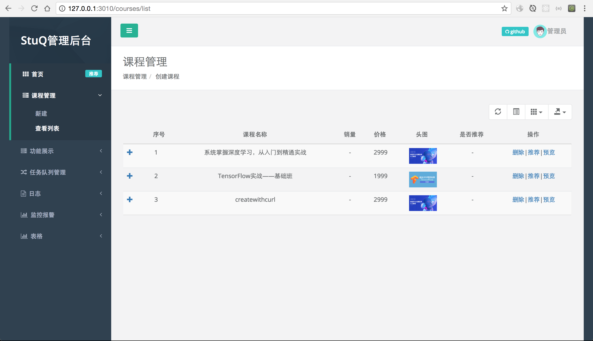

# 后台管理

所谓的后台管理，其实就是cms（内容管理系统），你所见到的网站，需要由编辑或者运营提供内容的。



## 一定要有一个自己习惯的admin框架

https://github.com/moajs/moa2-frontend

创建git仓库

https://github.com/i5ting/coursehaha-admin

将下载的zip代码丢进去

```
$ npm i
$ npm start
```

## Api约定

客户端 API 开发总结  https://cnodejs.org/topic/552b3b9382388cec50cf6d95

API 标准写法

摘抄：http://www.startupcto.com/backend-tech/building-an-api-best-practices


You'll generally want to wrap all your API responses in an 'envelope' which specifies metadata about the APIcall.

```
// sample JSON envelope
{
  "status": {
    "code": 10000,
    "message": 'Success'
  },
  "response": {
     ...results...
  }
}
```

Doing this allows for client handler code to behave the same way for all API calls, since it gets a responses back in a universal format.

语义上再好一点，推荐：

```
// sample JSON envelope
{
  "status": {
    "code": 10000,
    "message": 'Success'
  },
  "data": {
     ...results...
  }
}
```

可视化编辑校验： http://jsoneditoronline.org/

注意事项

- json一定要规范，不然ios的json库无法读
- 如果支持jsonp，自己再加上一个callback就可以了。
- 状态码说明：code：10000类似的，要以业务或者功能模块来分类，以便debug的时候快速定位
- 尽量遵守rest

api的最佳实践

- [best-practices-for-a-pragmatic-restful-api](http://www.vinaysahni.com/best-practices-for-a-pragmatic-restful-api)

看open api

- http://developer.github.com/v3/
- [微博API](http://open.weibo.com/wiki/微博API)

在node.js里有2个模块

- res.api
- koa.res.api

在我们的路由里直接这样使用

```
router.get('/a' , function (ctx) {
  ctx.api({
    a:1
  })
})
```

返回结果

```
{
  "data": {
    "a": 1
  },
  "status": {
    "code": 0,
    "msg": "request success!"
  }
}
```


## 修改菜单

views/layout/menu.jade

```
nav.navbar-default.navbar-static-side(role='navigation')
  .sidebar-collapse
    ul#side-menu.nav.metismenu
      li.nav-header
        .dropdown.profile-element
          #current-env.env-element(env='daily') StuQ管理后台
        .logo-element Moajs
      li
        a(href='/')
          i.fa.fa-th
          span.nav-label 首页
          span.label.label-info.pull-right 推荐
      li
        a(href='#')
          i.fa.fa-server
          span.nav-label 课程管理
          span.fa.arrow
        ul.nav.nav-second-level.collapse
          li
            a(href='/courses/new') 新建
          li
            a(href='/courses/list') 查看列表
```

其实你要关注的只是li，其实换成配置json更好，不过定制能力弱点。

## 写页面

moa2-frontend的做法，和express一模一样的，完全是res.render的做法。

创建

- views/courses/list.jade
- views/courses/create.jade

内置bootstrap_table和bootstrap，jquery，所以写起来非常简单。

## 问题

- 图片上传问题
- api授权问题
- api访问与前后端分离
- 服务器部署
